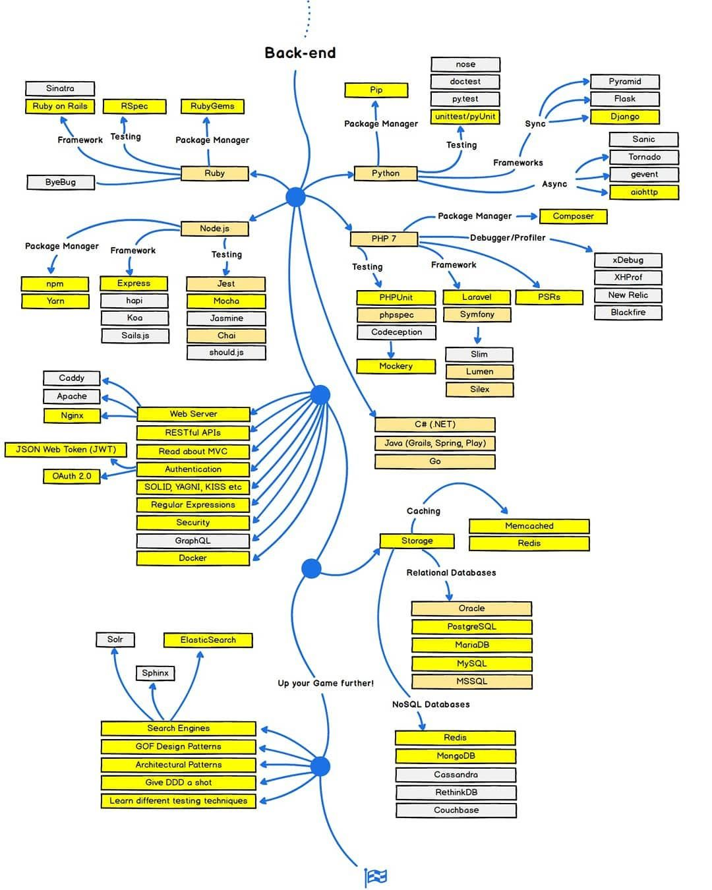

# Backend Deveoper Learning Path

## Languages

- [ ] Python:
  - [ ] [Python official Tutorial](https://docs.python.org/3/tutorial/index.html)
  - [ ] [Real Python Tutorials](https://realpython.com/)

## Frameworks

### Sync
- [ ] Django:
  - [ ] [Django project documentation](https://docs.djangoproject.com/en/3.0/)
  - [ ] [Two Scoops Of Django](https://www.amazon.com/Two-Scoops-Django-1-11-Practices/dp/0692915729)

## Storage

### relational databases
- [ ] Postgres:
  - [ ] [Installing pgadmin on ubuntu](https://computingforgeeks.com/how-to-install-pgadmin-4-on-ubuntu/)

## Authentication
- [ ] [Understanding Authentication, Authorization, and Encryption](https://www.bu.edu/tech/about/security-resources/bestpractice/auth/)
- [ ] OAuth:
  - [ ] [OAuth 2.0 and OpenID Connect (in plain English)](https://www.youtube.com/watch?v=996OiexHze0)
  - [ ] [An Illustrated Guide to OAuth and OpenID Connect](https://www.youtube.com/watch?v=t18YB3xDfXI) -> To Recap 
  - [ ] [Django social authentication](https://www.digitalocean.com/community/tutorials/django-authentication-with-facebook-instagram-and-linkedin) 
  - [ ] OAuth Tools:
    - [OAuth 2.0 Debugger](https://oauthdebugger.com/)
    - [OpenID Connect Debugger](https://oidcdebugger.com/)

## Docker

- [ ] [Docker ofiicial documentation](https://docs.docker.com/install/)
- [ ] [A beginner's guide to Docker](https://www.freecodecamp.org/news/a-beginners-guide-to-docker-how-to-create-your-first-docker-application-cc03de9b639f/)
- [ ] [A beginner's guide to Docker-part 2](https://herewecode.io/blog/a-beginners-guide-to-docker-how-to-create-a-client-server-side-with-docker-compose/)
- [ ] [How to start a Django Project with Docker](https://coderbook.com/@marcus/how-to-start-a-django-project-with-docker/)
      
## Search Engines
- [ ] Elastic Search:
  - [ ] [Get to know elasticsearch](https://www.botreetechnologies.com/blog/elasticsearch-with-django-part-4) <b> 4 parts </b>
  - [ ] [Elasticsearch and Django!](https://sunscrapers.com/blog/how-to-use-elasticsearch-with-django/)
