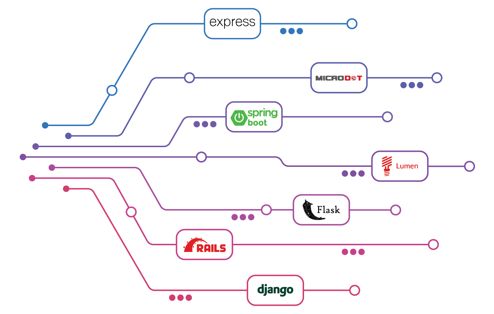
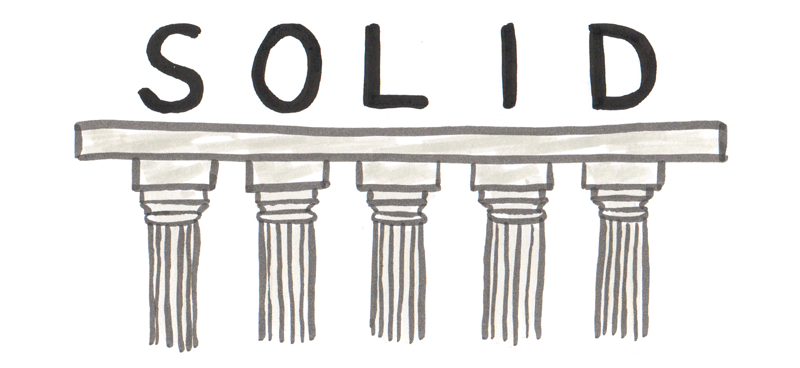
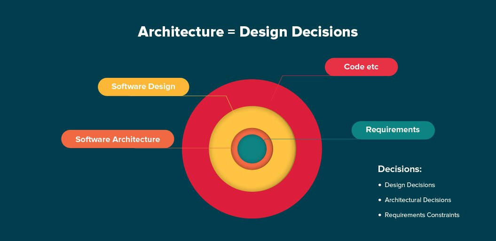

# Backend Deveoper Learning Path

## Languages

- [ ] Python:
  - [ ] [Python official website](https://python.org/)
  - [ ] [Python official Tutorial](https://docs.python.org/3/tutorial/index.html)
  - [ ] [Real Python Tutorials](https://realpython.com/)

## Frameworks

### Sync
- [ ] Django:
  - [ ] [Django project documentation](https://docs.djangoproject.com/en/3.0/)
  - [ ] [Two Scoops Of Django](https://www.amazon.com/Two-Scoops-Django-1-11-Practices/dp/0692915729)
  - [ ] [Django Rest Framework](https://www.django-rest-framework.org/)
- [ ] Flask:
  - [ ] [Flask Api Zero To Yoda](https://dev.to/paurakhsharma/flask-rest-api-part-0-setup-basic-crud-api-4650)
  
  #### additional django stuff:
  - [ ] [Classy Class-Based Views](http://ccbv.co.uk/)
  - [ ] [Classy Django REST Framework](http://www.cdrf.co/)

## Storage

### relational databases
- [ ] Postgres:
  - [ ] [Installing pgadmin on ubuntu](https://computingforgeeks.com/how-to-install-pgadmin-4-on-ubuntu/)

- [ ] Additional Reading:
  - [ ] [Database Design Fundamentals](https://www.vertabelo.com/blog/design_fundamentals/)
  - [ ] [Design Patterns](https://www.vertabelo.com/blog/design_patterns/)
  - [ ] [Database Design In Practical Examples](https://www.vertabelo.com/blog/example_models/)
  - [ ] [SQL](https://www.vertabelo.com/blog/sql/)
  - [ ] [Database Internals](https://www.vertabelo.com/blog/database_internals/)
  - [ ] [Random Stuff](https://www.vertabelo.com/blog/others/)

## Web Server

- [ ] Nginx:
  - [ ] [Nginx official website](https://www.nginx.com/)
- [ ] Additional Resources:
  - [ ] [Gunicorn](https://gunicorn.org/)

## Authentication
- [ ] [Understanding Authentication, Authorization, and Encryption](https://www.bu.edu/tech/about/security-resources/bestpractice/auth/)
- [ ] OAuth:
  - [ ] [OAuth 2.0 and OpenID Connect (in plain English)](https://www.youtube.com/watch?v=996OiexHze0)
  - [ ] [An Illustrated Guide to OAuth and OpenID Connect](https://www.youtube.com/watch?v=t18YB3xDfXI) -> To Recap 
  - [ ] [Django social authentication](https://www.digitalocean.com/community/tutorials/django-authentication-with-facebook-instagram-and-linkedin) 
  - [ ] OAuth Tools:
    - [OAuth 2.0 Debugger](https://oauthdebugger.com/)
    - [OpenID Connect Debugger](https://oidcdebugger.com/)

## Docker

- [ ] [Install Docker Engine - official website](https://docs.docker.com/install/)
- [ ] [Install Docker-Compose - official website](https://docs.docker.com/compose/)
- [ ] [A beginner's guide to Docker](https://www.freecodecamp.org/news/a-beginners-guide-to-docker-how-to-create-your-first-docker-application-cc03de9b639f/)
- [ ] [A beginner's guide to Docker-part 2](https://herewecode.io/blog/a-beginners-guide-to-docker-how-to-create-a-client-server-side-with-docker-compose/)
- [ ] [How to start a Django Project with Docker](https://coderbook.com/@marcus/how-to-start-a-django-project-with-docker/)
- [ ] [Dockerizing Django with Postgres, Gunicorn, and Nginx](https://testdriven.io/blog/dockerizing-django-with-postgres-gunicorn-and-nginx/)
- [ ] Additional Reading:
  - [ ] [Docker for Python Developers](https://mherman.org/presentations/dockercon-2018/#1)
  - [ ] [Using Alpine can make Python Docker builds 50× slower](https://pythonspeed.com/articles/alpine-docker-python/)
  - [ ] [9 Common Dockerfile Mistakes](https://runnable.com/blog/9-common-dockerfile-mistakes)
      
## Search Engines
- [ ] Elastic Search:
  - [ ] [Get to know elasticsearch](https://www.botreetechnologies.com/blog/elasticsearch-with-django-part-4) <b> 4 parts </b>
  - [ ] [Elasticsearch and Django!](https://sunscrapers.com/blog/how-to-use-elasticsearch-with-django/)
## OOP

- [ ] [How to explain object-oriented programming concepts to a 6-year-old](https://www.freecodecamp.org/news/object-oriented-programming-concepts-21bb035f7260/)

### SOLID

- [ ] [SOLID OOP Principles](https://www.youtube.com/playlist?list=PL4CE9F710017EA77A)

### KISS, DRY, YAGNI

These are software design principles, you'll get the meaning just by knowing the name meanings!

- KISS : Keep it stupid, simple
- DRY  : Don't repeat yourself
- YAGNI: You ain't gonna need it!
- TDA  : Tell don’t ask
- SoC  : Separation of Concerns

if you have time you can read a full article on this
- [ ] [How to become a better programmer ?](https://medium.com/@derodu/design-patterns-kiss-dry-tda-yagni-soc-828c112b89ee)

### Design Patterns

A good resource for learning design patterns and refactoring:
- [ ] [Refactoring Guru](https://refactoring.guru/)
- [ ] [DESIGN PATTERNS in different programming languages](https://refactoring.guru/design-patterns/examples)

and while you're here, check out these [AntiPatterns!](https://sourcemaking.com/antipatterns)

### Architectural Styles & Patterns

- [ ] [Types of Architectural Styles](https://www.youtube.com/watch?v=JLbo9Lvvy5M&list=PLmTD7qP4f9suAxW6qTAAILI4JjoY5V6ZN&index=1)
- [ ] [Architectural styles and patterns](https://en.wikipedia.org/wiki/Software_architecture#Architectural_styles_and_patterns)
- [ ] [What is SOA? - IBM explains](https://www.ibm.com/cloud/learn/soa)
- [ ] [What is Event-Driven Architecture? - RedHat explains](https://www.redhat.com/en/topics/integration/what-is-event-driven-architecture)
- [ ] [What are MicroServices? - Martin Fowler explains!](https://www.youtube.com/watch?v=wgdBVIX9ifA&list=LLW5HZo3PqiNz5m7z_WxJADA&index=8&t=0s)
- [ ] [API Styles: SOAP, REST, RPC, GraphQL and more](https://api-university.com/blog/styles-for-apis-soap-rest-and-rpc/)
  
  ## Additional 
  - [ ] WebSocket:
    - [ ] [Everything you ever wanted to know about WebSockets, literally!](https://hackernoon.com/everything-you-ever-wanted-to-know-about-websockets-literally-a05f36432999)
  - [ ] Debugging:
    - [ ] [Check out sentry](https://sentry.io)
